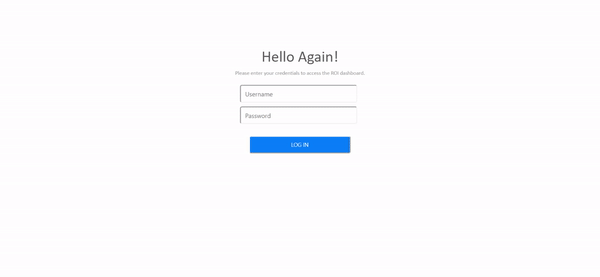

# ROI Dashboard

This repository contain source code for ROI Dashboard, a multipage application created using Plotly Dash. 

App in action: shows login, calculate in dashboard, and logout



## Multipage App Folder Structure

For this app, we followed this folder structure:

```
ROI-dashboard
│   index.py
|   app.py
└───apps
│   │   __init__.py
│   │   roi_page.py
```

## Running the app

The `index.py` contains the main page of the app. It updates the page contents and url to be able to access other pages and dashboard. It contains the login, error login, and logout button as well.

`roi_page.py` contains the dashboard and other functionalities of the dashboard (calculate ROI, save, delete, edit).

## Data

User and password database is stored in the `user_management.db`. For the dashboard scenarios, they are stored in the the `scenarios.db`.

## Other files

Other files include:
1. `requirements.txt` - contains packages needed for deployment
2. `Procfile` - declares the command to be able to run the `index.py` when deployed

## Deployment

The app can run locally, but you may also view it via Heroku [roi-dashboard](https://roi-dashboard.herokuapp.com/).
